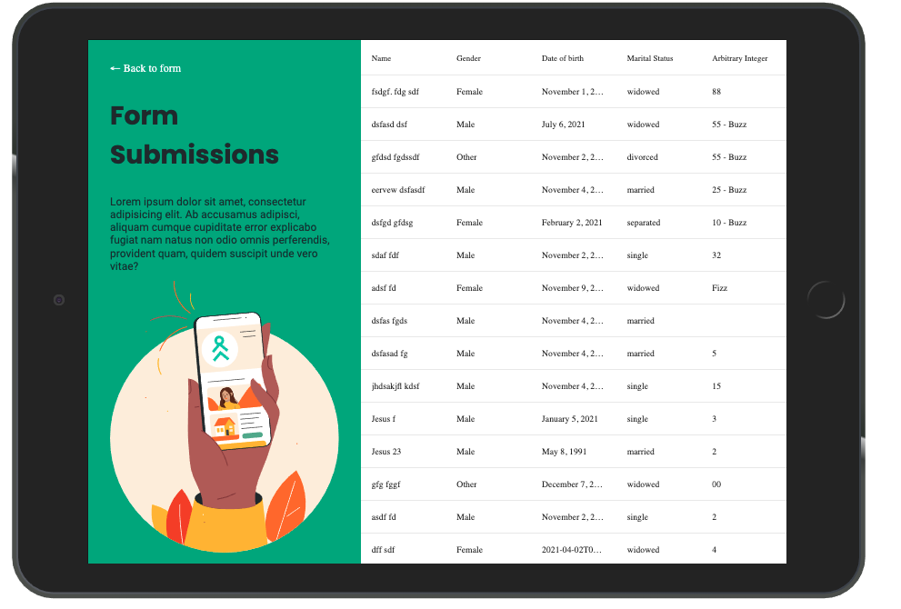

# useJetPackForm
# 
# 
# 
# 

## JetPackForm
JetPackForm is a simple form that you can use to not only get data but view the data that was inputted. The Form is fully responsive and includes some small but nice animations to guide and help the user through the form flow.

### Local Installation

1. Download [Node](https://nodejs.org/en/) version 10.15+
   > You can also download and setup [NVM](https://github.com/creationix/nvm) if you want to manage multiple versions of node.

## Run The Commands

Start your Setup
`npm install`

Run Development
`npm run dev`

Build for Production
`npm run build`

## The Folder Structure

Everything is in your src directory.

The source directory is broken into:
* Components
* hooks
* pages
* services
* state
* styles
* templates
* utils

## Components
This is Smaller pieces of components will be in. This will include things such as buttons, inputs, labels, ect...

## Hooks
This is where reusable and easy to integrate components are built. Hooks is something that can be used to when you want to modify a state of a component and get state from a component. This is an easier than prop drilling.

Currently in the hooks we have a signup form. This sign up was created to be in used with the signupForm template to validate, update and get state.

## Pages
Pages is where all the pages are being held for the views of the app.

## Services
Services is used as helper function. Maybe to connect to an api or validation.

## State
In JetPackForm we are using react context to pass state and get state.

## Styles
Styles is where the global styles pages and app is held

## Templates
Templates are components that are already put together by other components and can be placed anywhere in the pages and work out of the box.

## Utils
Utils directory is where functions are created to make our life easier by either formatting a date or fizz buzzing a number.